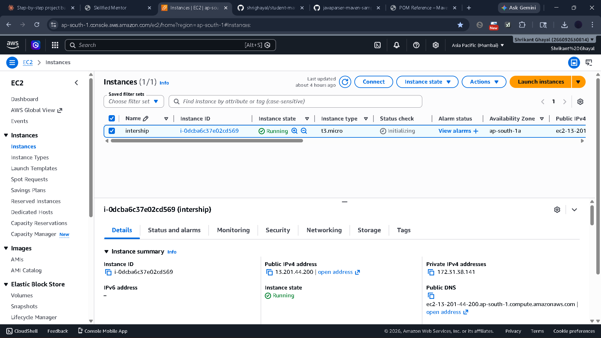
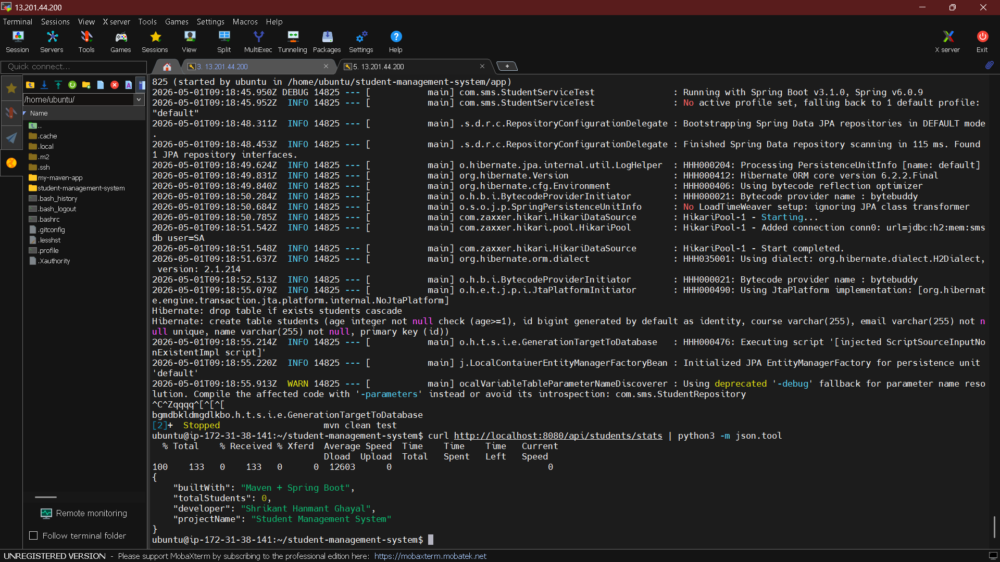
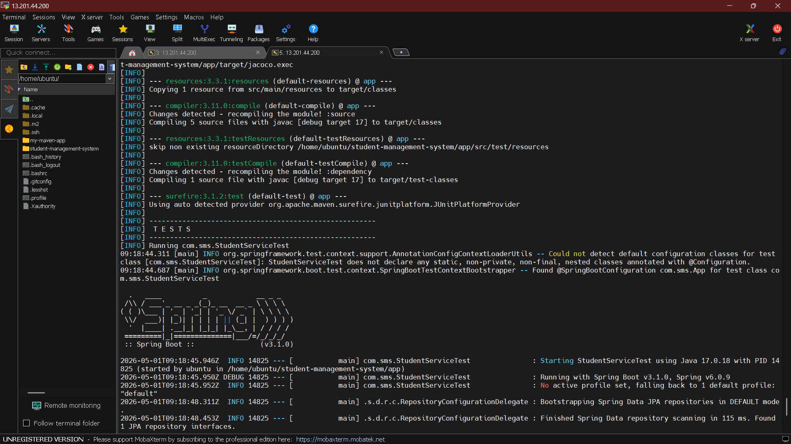
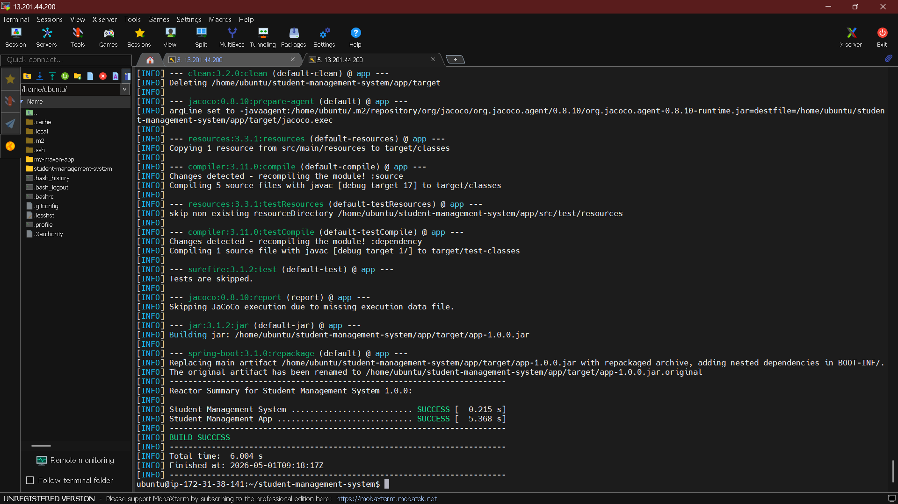

# 🎓 Student Management System

A **Spring Boot + Maven Multi-Module REST API** project to manage student data efficiently.

---

## 🚀 Features

* ➕ Add Student
* 📄 Get Student Details
* ✏️ Update Student
* ❌ Delete Student
* 🌐 REST API Architecture

---

## 🛠️ Tech Stack

* Java
* Spring Boot
* Maven
* REST API
* Git & GitHub

---

## 📂 Project Structure

```
student-management-system/
 ├── app/
 ├── pom.xml
 ├── images/
 │    └── output.png
 └── README.md
```

---

## ⚙️ Setup & Run

### 🔹 Clone Repository

```bash
git clone https://github.com/shrighayal/student-management-system.git
cd student-management-system
```

### 🔹 Build Project

```bash
mvn clean install
```

### 🔹 Run Application

```bash
mvn spring-boot:run
```

---

## 🌐 API Endpoints

| Method | Endpoint       | Description      |
| ------ | -------------- | ---------------- |
| GET    | /students      | Get all students |
| POST   | /students      | Add new student  |
| PUT    | /students/{id} | Update student   |
| DELETE | /students/{id} | Delete student   |

---

## 📸 Application Output

### 🔹 Running Application






---

## 🧪 Sample cURL Commands

### ➕ Add Student

```bash
curl -X POST http://localhost:8080/students \
-H "Content-Type: application/json" \
-d '{"name":"John","age":22}'
```

### 📄 Get Students

```bash
curl http://localhost:8080/students
```

---

## 👨‍💻 Author

**Shrikant Ghayal**

---

## ⭐ Show Your Support

If you like this project, give it a ⭐ on GitHub!

